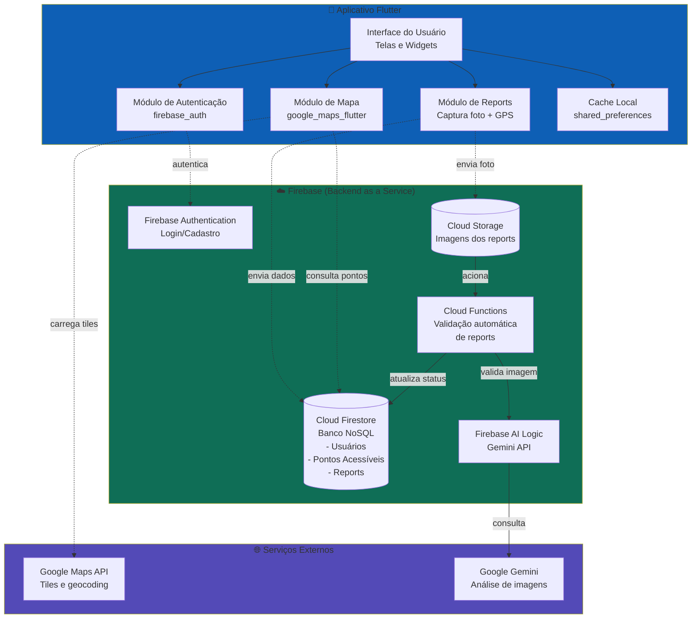

# Diagrama de Componentes

Este diagrama apresenta a visão estrutural do sistema, mostrando os componentes que compõem o aplicativo de acessibilidade para cadeirantes da FT, suas responsabilidades e como se comunicam entre si.

## Diagrama

## Descrição dos Componentes

### Cliente (Flutter)

| Componente | Responsabilidade |
|------------|------------------|
| Interface do Usuário | Telas, widgets e navegação do aplicativo |
| Módulo de Mapa | Renderização do mapa, marcadores e interação geográfica |
| Módulo de Autenticação | Login, cadastro e gerenciamento de sessão |
| Módulo de Reports | Captura de fotos, leitura de GPS e envio de reports |
| Cache Local | Armazenamento offline de preferências e dados temporários |

### Backend (Firebase)

| Componente | Responsabilidade |
|------------|------------------|
| Firebase Authentication | Gerenciamento de identidade e tokens de acesso |
| Cloud Firestore | Persistência de usuários, pontos acessíveis e reports |
| Cloud Storage | Armazenamento das imagens enviadas pelos usuários |
| Firebase AI Logic | Interface de comunicação com o Gemini |
| Cloud Functions | Lógica de validação automática disparada por triggers |

### Serviços Externos

| Serviço | Responsabilidade |
|---------|------------------|
| Google Maps API | Fornecimento de tiles, geocoding e dados cartográficos |
| Google Gemini | Análise visual das imagens dos reports via IA |
