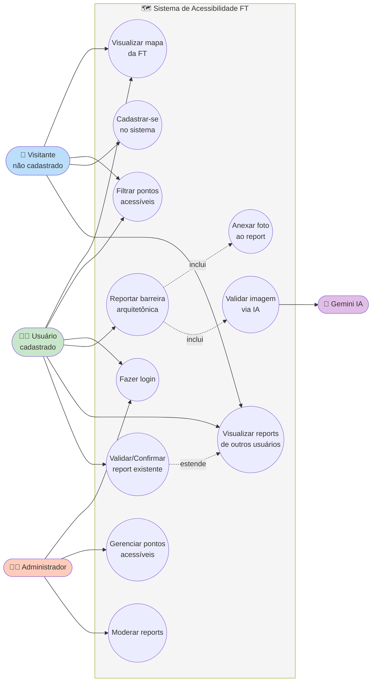

# Diagrama de Casos de Uso

Este diagrama apresenta as funcionalidades do sistema sob a ótica dos atores que interagem com ele. Identifica quem usa o sistema e quais ações estão disponíveis para cada tipo de usuário.

## Diagrama

## Atores

| Ator | Descrição |
|------|-----------|
| **Visitante** | Usuário não autenticado que pode apenas consultar informações públicas do sistema |
| **Usuário cadastrado** | Pessoa autenticada (cadeirante ou aliado) que pode consultar e contribuir com reports |
| **Administrador** | Responsável pela manutenção do conteúdo e moderação de reports problemáticos |
| **Gemini IA** | Ator não-humano (sistema externo) que executa validação automática das imagens |

## Casos de Uso

| ID | Caso de Uso | Atores Envolvidos |
|----|-------------|-------------------|
| UC1 | Visualizar mapa da FT | Visitante, Usuário |
| UC2 | Filtrar pontos acessíveis | Visitante, Usuário |
| UC3 | Cadastrar-se no sistema | Visitante |
| UC4 | Fazer login | Usuário, Administrador |
| UC5 | Reportar barreira arquitetônica | Usuário |
| UC6 | Anexar foto ao report | Usuário |
| UC7 | Visualizar reports de outros usuários | Visitante, Usuário |
| UC8 | Validar/Confirmar report existente | Usuário |
| UC9 | Gerenciar pontos acessíveis | Administrador |
| UC10 | Moderar reports | Administrador |
| UC11 | Validar imagem via IA | Gemini |

## Relacionamentos

- **UC5 inclui UC6:** todo report de barreira exige obrigatoriamente uma foto anexada.
- **UC5 inclui UC11:** todo report passa por validação automática via IA antes de ser publicado.
- **UC8 estende UC7:** a validação de reports é uma ação opcional executada a partir da visualização.
