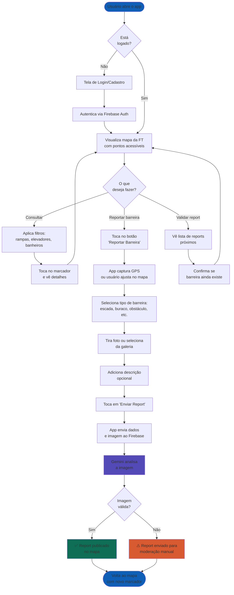
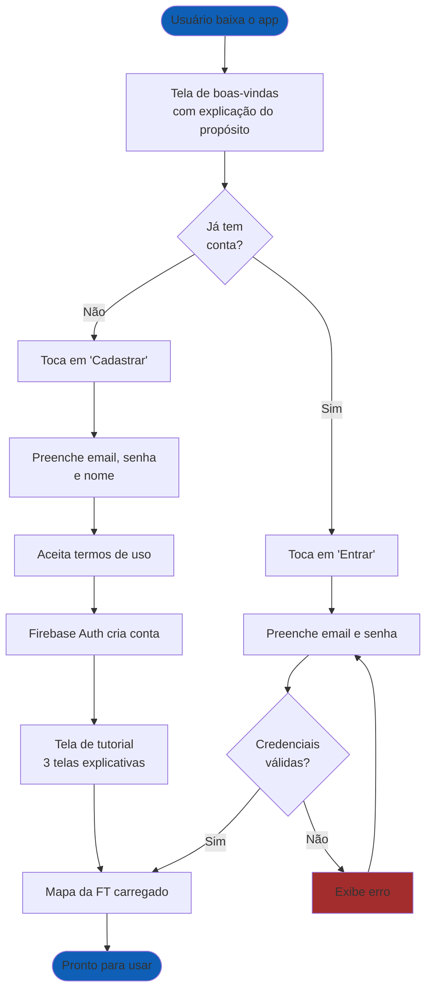
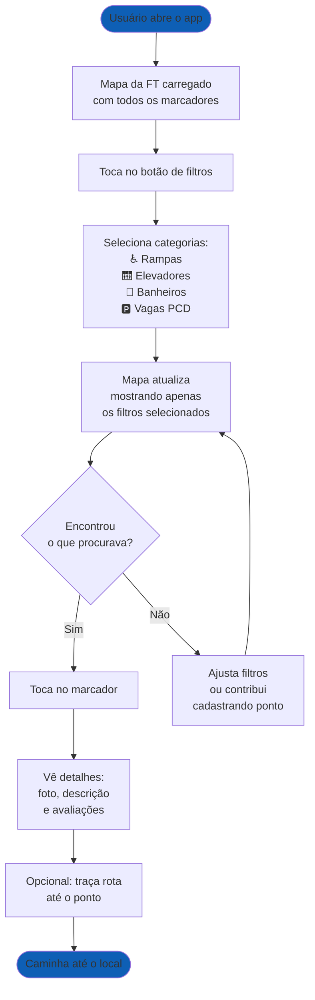

# Fluxo da Jornada do Usuário

Este documento apresenta o caminho concreto percorrido pelo usuário ao utilizar o aplicativo, mostrando telas, decisões e ações em sequência. Diferente do diagrama de casos de uso (que é abstrato), a jornada mostra o fluxo real de navegação.

## Jornada Principal: Reportar uma Barreira Arquitetônica

## Jornada Secundária: Cadastro e Primeiro Acesso

## Jornada Secundária: Consulta de Pontos Acessíveis

