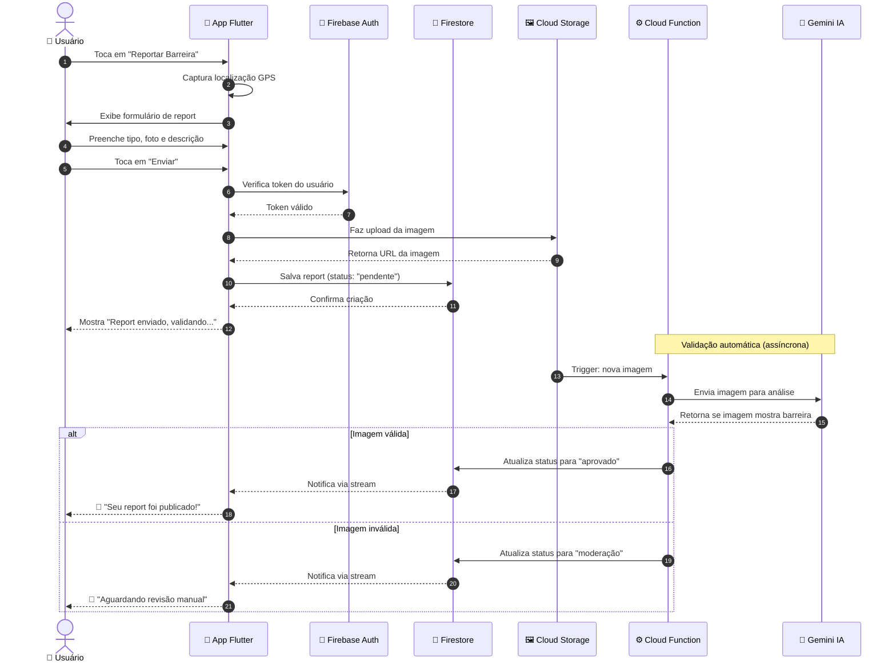
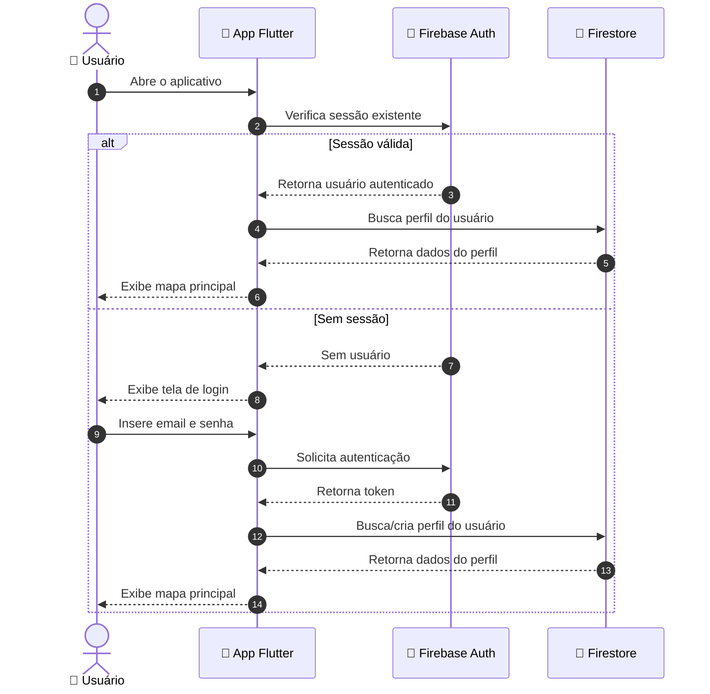
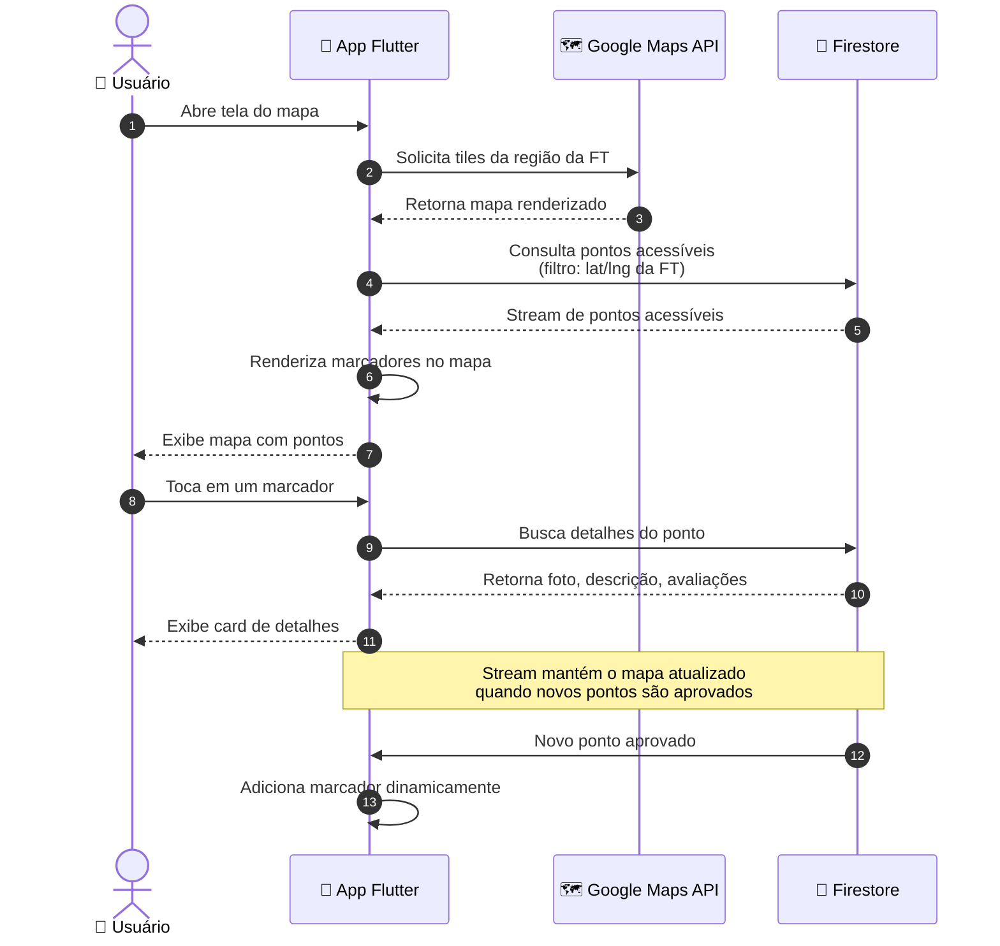

# Diagrama de Sequência

Este diagrama mostra a ordem temporal das interações entre os componentes do sistema durante a execução do fluxo principal: o envio e validação automática de um report de barreira arquitetônica.

## Fluxo: Reportar Barreira com Validação por IA

## Fluxo: Login do Usuário

## Fluxo: Consulta de Pontos Acessíveis no Mapa

## Observações Técnicas

- **Numeração automática:** o `autonumber` adiciona números sequenciais às mensagens, facilitando a referência durante apresentações.
- **Comunicação assíncrona:** o bloco `Note over CF,G` destaca que a validação por IA ocorre em background, sem bloquear a interface do usuário.
- **Streams do Firestore:** as setas de retorno nos fluxos de validação representam atualizações em tempo real via WebSocket, característica nativa do Firestore.
- **Notação `alt`:** representa caminhos alternativos baseados em condições (equivalente ao if/else).
