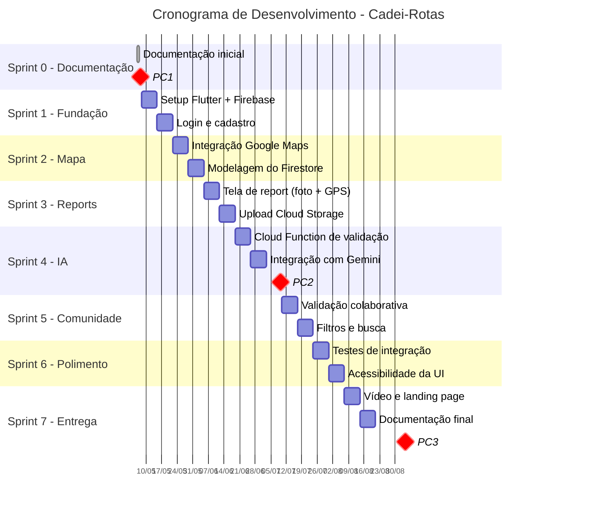

# Roadmap e Cronograma

Este documento apresenta o planejamento temporal do projeto, dividido em sprints de 2 semanas, alinhadas aos três pontos de controle (PC1, PC2 e PC3) da disciplina ENE0450.

## Gráfico Gantt

## Detalhamento das Sprints

### Sprint 0 — Documentação Inicial (06/05 a 07/05)

**Objetivo:** estruturar o projeto e entregar a documentação inicial completa.

**Atividades:**
- Definição do problema e escopo do projeto
- Levantamento de requisitos funcionais e não funcionais
- Criação do repositório no GitHub e setup de ferramentas
- Definição de papéis e responsabilidades na equipe
- Produção dos diagramas (componentes, casos de uso, sequência, jornadas)
- Elaboração do roadmap e cronograma
- Definição da identidade visual (paleta de cores, logo)

**Entrega:** documentação completa do **PC1** (07/05/2026).

---

### Sprint 1 — Fundação Técnica (08/05 a 21/05)

**Objetivo:** estabelecer a base técnica do aplicativo.

**Atividades:**
- Configuração do projeto Flutter com estrutura de pastas
- Integração com Firebase (Auth, Firestore, Storage)
- Implementação das telas de login e cadastro
- Configuração da navegação entre telas
- Setup do repositório com CI básico

**Entrega:** aplicativo navegável com autenticação funcionando.

---

### Sprint 2 — Mapa Base (22/05 a 04/06)

**Objetivo:** apresentar o mapa interativo com pontos pré-cadastrados.

**Atividades:**
- Integração do plugin `google_maps_flutter`
- Centralização e limites geográficos no perímetro da FT
- Modelagem das coleções no Firestore (usuários, pontos, reports)
- Cadastro manual dos pontos acessíveis iniciais (rampas e elevadores conhecidos da FT)
- Renderização dos marcadores no mapa

**Entrega:** mapa funcional exibindo pontos acessíveis pré-cadastrados.

---

### Sprint 3 — Sistema de Reports (05/06 a 18/06)

**Objetivo:** permitir que usuários criem reports de barreiras.

**Atividades:**
- Tela de criação de report com captura de foto via câmera
- Captura automática de GPS e ajuste manual no mapa
- Seleção de tipo de barreira (escada, buraco, obstáculo, etc.)
- Upload da imagem para Cloud Storage
- Gravação do report no Firestore
- Exibição em tempo real dos reports no mapa

**Entrega:** reports funcionando (sem validação por IA ainda).

---

### Sprint 4 — Inteligência Artificial + PC2 (19/06 a 09/07)

**Objetivo:** automatizar a validação de imagens via Gemini e entregar o PC2.

**Atividades:**
- Implementação da Cloud Function disparada por upload no Storage
- Integração com Gemini via Firebase AI Logic
- Definição do prompt de validação
- Atualização automática do status do report no Firestore
- Notificação ao usuário sobre aprovação ou moderação
- Landing page do produto
- Preparação da documentação e demonstração do PC2

**Entrega:** documentação do **PC2** (09/07/2026) + pipeline de validação automática funcionando.

---

### Sprint 5 — Comunidade (10/07 a 23/07)

**Objetivo:** adicionar funcionalidades colaborativas.

**Atividades:**
- Sistema de validação por outros usuários (confirmar/contestar reports)
- Filtros no mapa por tipo de barreira ou acessibilidade
- Listagem de reports próximos ao usuário
- Tela de perfil com histórico de contribuições

**Entrega:** aplicativo com funcionalidades colaborativas completas.

---

### Sprint 6 — Polimento e Testes (24/07 a 06/08)

**Objetivo:** garantir qualidade, estabilidade e acessibilidade.

**Atividades:**
- Testes de integração entre módulos
- Ajustes de acessibilidade da interface (contraste, leitor de tela, áreas de toque)
- Correção de bugs identificados
- Otimização de performance (cache, lazy loading)
- Testes em diferentes dispositivos e tamanhos de tela

**Entrega:** aplicativo estável, acessível e otimizado.

---

### Sprint 7 — Entrega Final (07/08 a 03/09)

**Objetivo:** preparar todos os artefatos finais para o PC3.

**Atividades:**
- Produção do vídeo demonstrativo da solução
- Finalização da landing page
- Atualização da documentação técnica no repositório
- Preparação da apresentação do PC3
- Ensaios da apresentação e demonstração

**Entrega:** documentação do **PC3** (03/09/2026) + protótipo final + vídeo demonstrativo.
