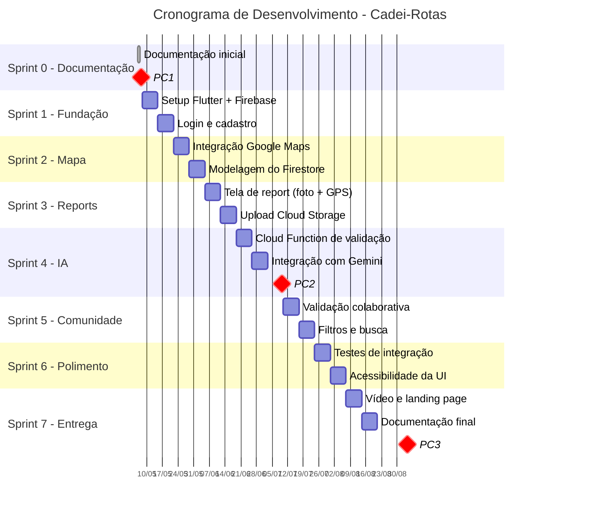

# Roadmap e Cronograma

Este documento apresenta o planejamento temporal do projeto, dividido em sprints de 2 semanas, alinhadas aos três pontos de controle (PC1, PC2 e PC3) da disciplina ENE0450.

## Visão Geral

- **Período:** Semestre 2026.1
- **Duração das sprints:** 2 semanas
- **Total de sprints:** 8 (incluindo Sprint 0 de planejamento)
- **Pontos de controle:** PC1 (final da Sprint 0), PC2 (final da Sprint 3), PC3 (final da Sprint 7)

> ⚠️ **Nota:** as datas abaixo são uma estimativa baseada no calendário típico do semestre 2026.1. Devem ser ajustadas conforme o calendário oficial da UnB e as datas exatas dos pontos de controle definidas pelo professor.

## Gráfico Gantt

## Detalhamento das Sprints

### Sprint 0 — Planejamento (3 semanas, antes do PC1)

**Objetivo:** estruturar o projeto e produzir a documentação inicial.

**Atividades:**
- Definição do problema e escopo do projeto
- Levantamento de requisitos funcionais e não funcionais
- Criação do repositório no GitHub e setup de ferramentas
- Definição de papéis e responsabilidades na equipe
- Produção dos diagramas (componentes, casos de uso, sequência, jornadas)
- Elaboração do roadmap e cronograma

**Entrega:** documentação completa do **PC1**.

### Sprint 1 — Fundação Técnica (2 semanas)

**Objetivo:** estabelecer a base técnica do aplicativo.

**Atividades:**
- Configuração do projeto Flutter com estrutura de pastas
- Integração com Firebase (Auth, Firestore, Storage)
- Implementação das telas de login e cadastro
- Configuração da navegação entre telas
- Setup de CI/CD básico no repositório

**Entrega:** aplicativo navegável com autenticação funcionando.

### Sprint 2 — Mapa Base (2 semanas)

**Objetivo:** apresentar o mapa interativo com pontos pré-cadastrados.

**Atividades:**
- Integração do plugin `google_maps_flutter`
- Centralização e limites geográficos no perímetro da FT
- Modelagem das coleções no Firestore (usuários, pontos, reports)
- Cadastro manual dos pontos acessíveis iniciais (rampas e elevadores conhecidos da FT)
- Renderização dos marcadores no mapa

**Entrega:** mapa funcional exibindo pontos acessíveis pré-cadastrados.

### Sprint 3 — Sistema de Reports (2 semanas + documentação PC2)

**Objetivo:** permitir que usuários criem reports de barreiras.

**Atividades:**
- Tela de criação de report com captura de foto via câmera
- Captura automática de GPS e ajuste manual no mapa
- Seleção de tipo de barreira (escada, buraco, obstáculo, etc.)
- Upload da imagem para Cloud Storage
- Gravação do report no Firestore
- Exibição em tempo real dos reports no mapa
- Landing page do produto

**Entrega:** documentação do **PC2** + reports funcionando (sem validação por IA ainda).

### Sprint 4 — Inteligência Artificial (2 semanas)

**Objetivo:** automatizar a validação de imagens via Gemini.

**Atividades:**
- Implementação da Cloud Function disparada por upload no Storage
- Integração com Gemini via Firebase AI Logic
- Definição do prompt de validação (verifica se imagem mostra de fato uma barreira)
- Atualização automática do status do report no Firestore
- Notificação ao usuário sobre aprovação ou moderação

**Entrega:** pipeline de validação automática funcionando.

### Sprint 5 — Comunidade e Refinamento (2 semanas)

**Objetivo:** adicionar funcionalidades colaborativas.

**Atividades:**
- Sistema de validação por outros usuários (confirmar/contestar reports)
- Filtros no mapa por tipo de barreira ou acessibilidade
- Listagem de reports próximos ao usuário
- Tela de perfil com histórico de contribuições
- Sistema de notificações para reports próximos

**Entrega:** aplicativo com funcionalidades colaborativas completas.

### Sprint 6 — Polimento e Testes (2 semanas)

**Objetivo:** garantir qualidade, estabilidade e acessibilidade.

**Atividades:**
- Testes de integração entre módulos
- Ajustes de acessibilidade da interface (contraste, leitor de tela, áreas de toque)
- Correção de bugs identificados
- Otimização de performance (cache, lazy loading)
- Testes em diferentes dispositivos e tamanhos de tela

**Entrega:** aplicativo estável, acessível e otimizado.

### Sprint 7 — Entrega Final (2 semanas)

**Objetivo:** preparar todos os artefatos finais para o PC3.

**Atividades:**
- Produção do vídeo demonstrativo da solução
- Finalização da landing page
- Atualização da documentação técnica no repositório
- Preparação da apresentação do PC3
- Ensaios da apresentação e demonstração

**Entrega:** documentação do **PC3** + protótipo final + vídeo demonstrativo.

## Pontos de Controle e Entregáveis

| Ponto de Controle | Sprint | Entregáveis Principais |
|-------------------|--------|------------------------|
| **PC1** | Final da Sprint 0 | Documentação completa, diagramas, roadmap |
| **PC2** | Final da Sprint 3 | Subsistemas funcionando, landing page, documentação atualizada |
| **PC3** | Final da Sprint 7 | Protótipo final, vídeo, documentação completa |

## Distribuição de Responsabilidades

> Esta seção deve ser preenchida pela equipe com a alocação real dos membros. Sugestão de papéis:

- **Project Manager (1 pessoa):** coordena sprints, mantém cronograma e documentação geral
- **Frontend Flutter:** telas, navegação, integração com mapas
- **Backend Firebase:** Firestore, Cloud Functions, integração com Gemini
- **UX/Acessibilidade:** design das telas, testes de usabilidade, conformidade com padrões de acessibilidade
- **QA/Testes:** validação dos fluxos, testes de integração, documentação de bugs

## Riscos e Mitigações

| Risco | Probabilidade | Impacto | Mitigação |
|-------|---------------|---------|-----------|
| Custos do Firebase excederem o plano gratuito | Média | Alto | Monitorar uso, otimizar queries, considerar plano educacional |
| Gemini retornar resultados inconsistentes | Média | Médio | Usar moderação manual como fallback, refinar prompts |
| Atrasos na integração com Google Maps | Baixa | Médio | Iniciar integração na Sprint 2, ter alternativa OpenStreetMap |
| Indisponibilidade de membros da equipe | Média | Alto | Documentar tudo no repositório, fazer pair programming |
