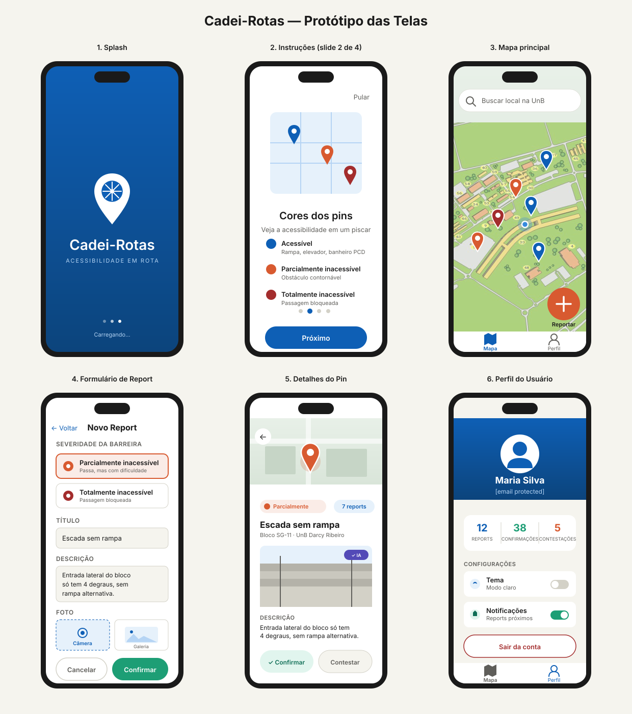

# Protótipos de Tela — Cadei-Rotas

Este documento apresenta os mockups das 6 telas principais do aplicativo, todos baseados na paleta de cores oficial do projeto.

## Visão Geral

> Para uma visualização ampliada, abra o arquivo `assets/mockup-telas.svg` em qualquer navegador.

## Descrição das Telas

### Tela 1 — Splash / Carregamento

Tela de abertura exibida enquanto o app inicializa e verifica autenticação. Fundo em gradiente do **Azul Rota** (`#0E5FB5`) ao **Azul Profundo** (`#0C447C`), com a logo branca centralizada e indicador de carregamento.

**Duração:** 1 a 2 segundos. Após a verificação, navega para:
- Slides de instrução (se primeira vez)
- Mapa principal (se já cadastrado)

### Tela 2 — Slides de Instrução

Conjunto de 4 slides explicando as funcionalidades principais do app. Aparece apenas no primeiro acesso ou quando o usuário toca em "Ver tutorial" na tela de perfil.

**Slides previstos:**
1. Boas-vindas e propósito do app
2. Cores dos pins (acessível, parcial, inacessível)
3. Como reportar uma barreira
4. Como contribuir com a comunidade

Ao final do quarto slide, o botão muda de "Próximo" para "Começar" e leva ao mapa.

### Tela 3 — Mapa Principal

Tela central do app, exibida a maior parte do tempo. Mostra o mapa da UnB com os pins coloridos conforme a categoria:

- 🔵 **Azul** (`#0E5FB5`): locais acessíveis (rampas, elevadores, banheiros PCD) — pré-cadastrados pelo sistema
- 🟠 **Laranja** (`#D85A30`): barreiras parcialmente inacessíveis — reportadas por usuários
- 🔴 **Vermelho** (`#A32D2D`): bloqueios totais — reportados por usuários

**Elementos:**
- Barra de busca no topo
- Localização atual do usuário (círculo azul pulsante)
- FAB laranja no canto inferior direito para iniciar um report
- Barra de navegação inferior com "Mapa" e "Perfil"

### Tela 4 — Formulário de Report

Formulário em uma única tela, navegação top-down:

1. **Severidade da barreira:** dois cards radio com cores correspondentes (laranja/vermelho)
2. **Título:** campo de texto curto
3. **Descrição:** área de texto multi-linha
4. **Foto:** dois botões grandes para escolher entre Câmera e Galeria

**Ações:** botão "Cancelar" (volta ao mapa) e botão "Confirmar" em verde. Ao confirmar, o app volta ao mapa em modo "posicionamento" para o usuário tocar no local exato com um único toque.

### Tela 5 — Detalhes do Pin

Aparece ao tocar em qualquer pin do mapa. Mini-mapa no topo mantém o contexto geográfico. Card principal mostra:

- Badge com severidade (cor correspondente)
- Contador de reports da comunidade
- Título e localização
- Foto principal com selo "✓ IA" (validação automática pelo Gemini, em roxo `#534AB7`)
- Descrição
- Dois botões de ação: **Confirmar** (verde, "esta barreira ainda existe") e **Contestar** (cinza, "essa barreira já foi resolvida")

### Tela 6 — Perfil do Usuário

Tela acessada via aba "Perfil" da bottom nav. Contém:

- Header azul com avatar, nome e e-mail
- Card de estatísticas: número de reports, confirmações dadas e contestações
- Configurações: toggle de tema (claro/escuro) e toggle de notificações
- Botão "Sair da conta" em vermelho (ação destrutiva)

## Princípios de Design Aplicados

**Áreas de toque amplas:** todos os botões interativos têm altura mínima de 44px (padrão WCAG/Material Design para acessibilidade motora).

**Contraste alto:** textos sempre em `#1A1A1A` ou `#FFFFFF` sobre fundos da paleta, garantindo razão de contraste mínima 4.5:1.

**Hierarquia visual clara:** uso consistente de pesos tipográficos (700 para títulos, 600 para subtítulos e botões, 400 para corpo).

**Feedback de estado:** elementos selecionados sempre têm borda colorida + cor de fundo suave da paleta (ex: card de severidade selecionado usa `#FAECE7` com borda `#D85A30`).

**Consistência cromática:** cada cor tem uma função semântica fixa (azul = acessibilidade/marca, verde = sucesso/confirmação, laranja = atenção, vermelho = bloqueio/destrutivo, roxo = IA).

## Próximos Passos

Estes mockups são protótipos de média fidelidade para o PC1. Durante a Sprint 1 e 2 do desenvolvimento, serão refinados com:

- Animações de transição entre telas
- Estados intermediários (loading, erro, vazio)
- Variações para tema escuro
- Versões para tablets e diferentes tamanhos de tela
- Testes de acessibilidade com leitor de tela
