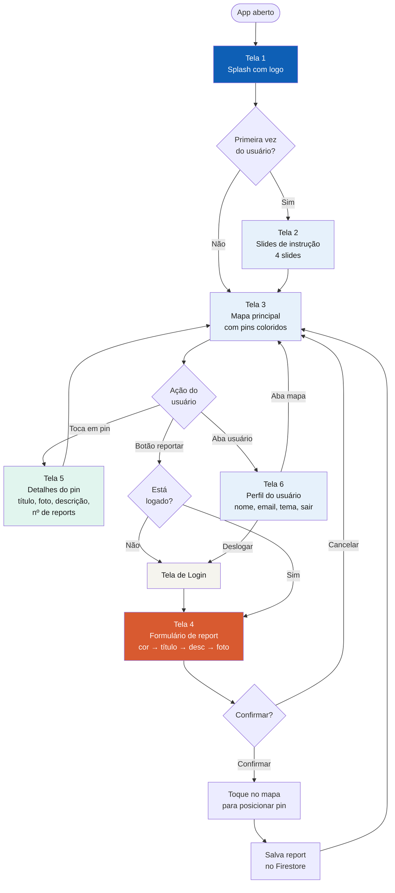
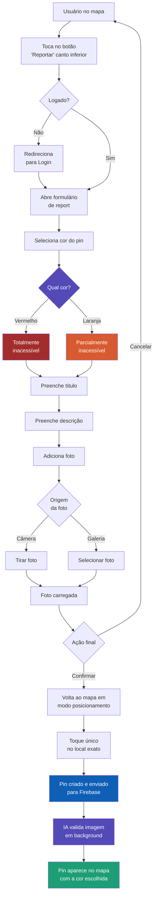

# Fluxo de Navegação entre Telas

Este documento apresenta dois diagramas de fluxo do aplicativo Cadei-Rotas: o fluxo geral de navegação entre todas as telas e o fluxo detalhado da ação principal (reportar uma barreira).

## Fluxo Geral entre Telas

## Fluxo Detalhado: Reportar uma Barreira

## Legenda de Cores dos Pins

| Cor | Significado |
|-----|-------------|
| 🔵 Azul (`#0E5FB5`) | Local acessível (rampa, elevador, banheiro PCD) — pin fixo do sistema |
| 🟠 Laranja (`#D85A30`) | Parcialmente inacessível — reportado pelo usuário |
| 🔴 Vermelho (`#A32D2D`) | Totalmente inacessível — reportado pelo usuário |

## Telas do Aplicativo

| # | Tela | Descrição |
|---|------|-----------|
| 1 | Splash | Tela de carregamento com a logo |
| 2 | Instruções | 4 slides explicando o app (só primeira vez) |
| 3 | Mapa principal | Mapa da UnB com pins coloridos e botão de reportar |
| 4 | Formulário de Report | Cor → Título → Descrição → Foto |
| 5 | Detalhes do Pin | Informações de um pin específico |
| 6 | Perfil | Dados do usuário, tema e logout |
